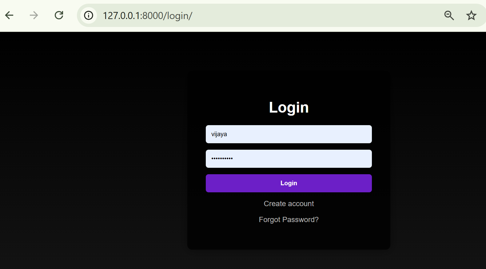
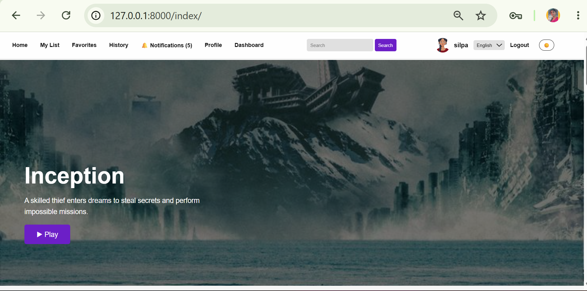
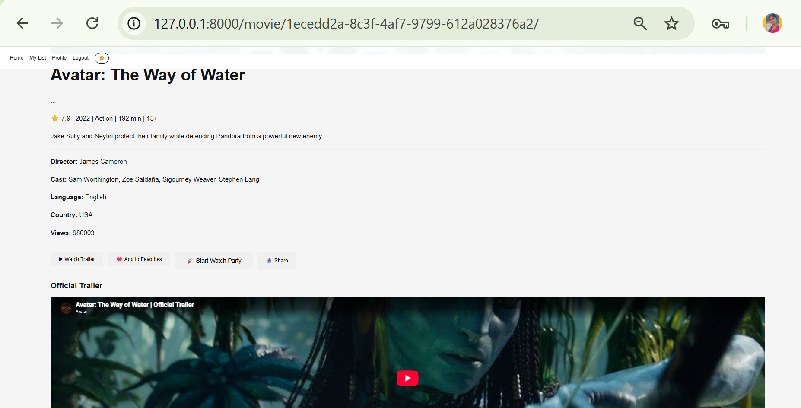
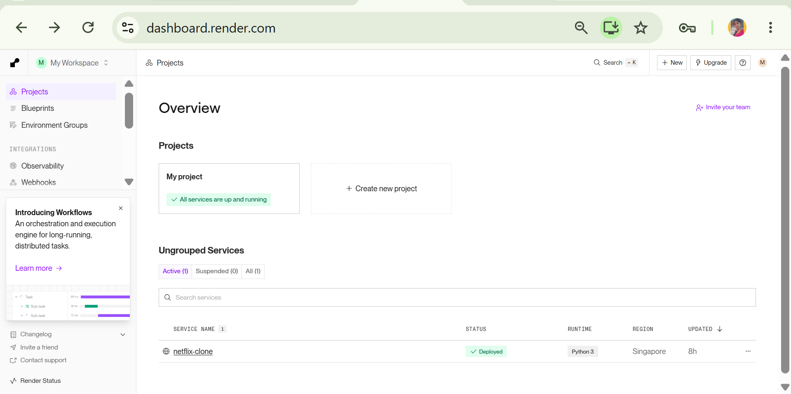

# 🎬 CineVerse — AI-Powered Streaming Platform

**CineVerse** is a full-stack, Netflix-style movie streaming web application built with **Django**, featuring a **real-time WebSocket architecture** and **six independent AI/ML features** — content-based recommendations, collaborative filtering, semantic search, voice search, sentiment analysis, and a conversational chatbot.

> Built as a hands-on project to apply Python Full Stack Development and AI/ML concepts together in one production-style application, rather than as isolated exercises.

---

## 🚀 Live Demo

🔗 **[Live URL — Render Deployment]** *(add your link here once live)*

---

## 📸 Screenshots






---

## 📋 Table of Contents
- [Screenshots](#-screenshots)
- [Key Highlights](#-key-highlights)
- [Core Full-Stack Features](#-core-full-stack-features)
- [Real-Time Architecture](#-real-time-architecture-django-channels--daphne--redis)
- [AI / ML Features](#-ai--ml-features)
- [Tech Stack](#-tech-stack)
- [Project Structure](#-project-structure)
- [Setup & Installation](#-setup--installation-local)
- [A Real Debugging Story](#-a-real-debugging-story)
- [Future Roadmap](#-future-roadmap)

---

## ⭐ Key Highlights

| | |
|---|---|
| 🏗️ **Architecture** | ASGI-based Django app served via **Daphne**, using **Django Channels** + **Redis** for real-time, bidirectional communication |
| 🤖 **AI/ML** | 6 distinct AI features: content-based & collaborative recommendations, semantic search, voice search, sentiment analysis, NLP chatbot |
| 🔐 **Auth & Profiles** | Multi-profile accounts (like Netflix), Kids-mode content filtering |
| ⚡ **Real-Time** | Live notifications, live "watching now" counters, live chat during playback, live dashboard stat updates — all pushed instantly via WebSockets, no page refresh |
| 🌍 **i18n** | Multi-language UI support |
| 🎨 **UX** | Dark/light theme, responsive design, live search-as-you-type |

---

## 🧩 Core Full-Stack Features

- **Authentication** — signup, login, logout, forgot-password flow
- **Multi-Profile Accounts** — multiple viewer profiles per account (Netflix-style), including Kids profiles that automatically filter content by age rating
- **Content Discovery** — Trending, Top Rated, Originals, Recently Added, Top 10, genre filters, sorting (rating / latest / views / A-Z)
- **Continue Watching** — per-user watch-progress tracking (%) per movie
- **My List / Favorites / Watch Later** — personal watchlists
- **Reviews & Ratings** — 1–5 star ratings with written reviews
- **Live Search-as-you-type** — instant AJAX search suggestions in the navbar
- **Watch Party** — generate a shareable room code so multiple users can watch and chat together in sync
- **Personal Dashboard** — live-updating stats (movies watched, favorites, reviews, etc.)
- **Multi-language UI** — Django i18n with a language switcher
- **Dark / Light Theme Toggle**

---

## ⚡ Real-Time Architecture (Django Channels + Daphne + Redis)

Most of the "live" features in this app are not built with polling or page-refresh tricks — they use a genuine **ASGI WebSocket architecture**:

```
Browser (WebSocket) ⇄ Daphne (ASGI server) ⇄ Django Channels (Consumers) ⇄ Redis (Channel Layer)
```

- **Daphne** replaces the standard WSGI server to serve the app over ASGI, enabling it to handle both HTTP and long-lived WebSocket connections.
- **Django Channels** defines WebSocket consumers that manage connection lifecycles (`connect`, `receive`, `disconnect`) per feature.
- **Redis** acts as the **channel layer** — the message broker that lets one request (e.g., "movie added to favorites") broadcast an event to every relevant connected client in real time, even across multiple server processes.

### Real-time features built on this stack:
1. **Live Notifications** — when a user favorites a movie, a notification is pushed instantly to their open browser tab (toast popup + live badge count update) via a per-user Channels group.
2. **Live "Watching Now" Counter** — a per-movie WebSocket group tracks and broadcasts how many users currently have that movie's page open.
3. **Live Chat During Playback** — users watching the same movie can exchange live comments with typing indicators, broadcast through a per-movie Channels group.
4. **Live Dashboard Updates** — stat cards (e.g., favorite count) update in real time across tabs without a page reload, using a per-user dashboard Channels group.

This demonstrates practical understanding of **asynchronous, event-driven backend architecture** — a step beyond typical CRUD Django apps.

---

## 🤖 AI / ML Features

This project intentionally implements **six different AI/ML techniques**, each solving a distinct real problem, rather than one single "AI feature bolted on."

### 1. Content-Based Recommendation Engine
**File:** `recommender.py`
Combines each movie's genre, description, cast, director, and language into a text profile, vectorizes all movies using **TF-IDF** (`scikit-learn`), and computes **Cosine Similarity** between every pair. Powers the "More Like This" section on every movie page with true content similarity — not just "same genre."

### 2. Collaborative Filtering — "Users Also Watched"
**File:** `recommender.py` → `get_collaborative_recommendations()`
An item-based collaborative filtering approach: for a given movie, it finds every user who watched it, then finds what *else* those users watched most often — surfacing patterns that content similarity alone can't see (e.g., two unrelated-genre movies that the same audience tends to watch together).

### 3. Semantic / Smart Search
**File:** `recommender.py` → `smart_search()`
Reuses the TF-IDF vector space to power search-by-meaning: a query is vectorized and compared against every movie's profile via cosine similarity, so searching by an **actor name, plot detail, or theme** (not just the title) surfaces the right results — something a plain `title__icontains` search cannot do.

### 4. Voice-Based Search
**Frontend:** Web Speech API (`SpeechRecognition`)
A microphone button in the navbar captures spoken queries directly in the browser (no server-side speech processing or API cost), transcribes them to text, and feeds them straight into the semantic search pipeline above — combining a hands-free UX layer with the existing AI search.

### 5. Sentiment Analysis on Reviews
**File:** `sentiment_analysis.py`
A lightweight, explainable, rule-based NLP sentiment classifier: scores review text against curated positive/negative word sets with basic negation handling (e.g., "not good" correctly flips to negative), then tags each review as **Positive / Negative / Neutral**, displayed as a badge next to the review.

### 6. Conversational Movie Chatbot
**File:** `views.py` → `chatbot_api()`
A rule-based NLP chatbot (floating widget on the homepage) that parses user intent — greetings, direct genre mentions, mood keywords ("sad", "funny", "scary" → mapped to genres), and "best/top rated" queries — then answers with live, ranked results pulled from the actual movie database.

> **Design note:** Features 5 & 6 use deterministic, explainable rule-based NLP rather than a paid LLM API. This was a conscious engineering trade-off — zero ongoing cost, fully explainable behavior, and no external dependency — while the code is structured so either could be swapped for a real LLM (e.g., the Anthropic API) without changing the surrounding request/response flow.

---

## 🛠️ Tech Stack

| Layer | Technology |
|---|---|
| Backend | Python, Django |
| Real-time server | Daphne (ASGI) |
| Real-time messaging | Django Channels, Redis (channel layer) |
| Database | SQLite (dev) / PostgreSQL (production-ready) |
| Frontend | HTML5, CSS3 (custom, CSS variables for theming), Vanilla JavaScript, jQuery |
| AI / ML | scikit-learn (TF-IDF, Cosine Similarity), pandas, Web Speech API |
| Deployment | Render |
| Tools | Git, GitHub, VS Code |

---

## 📂 Project Structure

```
Netflix_Clone/
├── manage.py
├── requirements.txt
├── static/assets/style.css        # All custom styling
├── staticfiles/                   # Collected static files (via collectstatic)
├── Netflix_Clone/
│   ├── settings.py                # Channels/Redis/ASGI config
│   ├── asgi.py                    # ASGI application (Daphne entry point)
│   └── urls.py
├── app/
│   ├── models.py                  # Movie, Genre, WatchHistory, Review, Notification, WatchPartyRoom, etc.
│   ├── views.py                   # Core views + chatbot_api()
│   ├── urls.py
│   ├── consumers.py                # Channels WebSocket consumers (notifications, trending, movie room, dashboard)
│   ├── routing.py                  # WebSocket URL routing
│   ├── recommender.py              # TF-IDF recommendation + collaborative filtering + semantic search
│   ├── sentiment_analysis.py       # Rule-based review sentiment classifier
│   └── templates/
│       ├── index.html              # Homepage incl. chatbot widget, voice search
│       └── movie.html              # Movie detail incl. live chat, similar/collaborative sections
```

---

## ⚙️ Setup & Installation (Local)

```bash
# 1. Clone the repository
git clone <your-repo-url>
cd Netflix_Clone

# 2. Create & activate a virtual environment
python -m venv myenv
myenv\Scripts\activate        # Windows
# source myenv/bin/activate   # macOS/Linux

# 3. Install dependencies
pip install -r requirements.txt

# 4. Start Redis (required for Channels)
# via Docker:
docker run -p 6379:6379 redis
# or install Redis locally

# 5. Apply migrations
python manage.py migrate

# 6. Collect static files
python manage.py collectstatic --noinput

# 7. Run via Daphne (ASGI)
daphne Netflix_Clone.asgi:application
```

Then open **http://127.0.0.1:8000/index/** in your browser.

---

## 🐞 A Real Debugging Story

The "Continue Watching" progress bars were visually merging between movie cards. Investigation via browser DevTools revealed two stacked issues:
1. A **CSS width mismatch** — `.progress-bar` (220px) was wider than its parent `.film-card` (170px), causing layout overflow between cards.
2. Django's `collectstatic` was serving a **stale cached copy** of `style.css` from `staticfiles/`, even after the source file in `static/` had been edited — the fix only took effect after confirming the source was saved *and* re-running `collectstatic`.

**Fix:** corrected the CSS width, added `overflow:hidden`, and verified via file timestamps that the collected static file actually matched the edited source before testing again — a realistic example of reproduce → inspect → isolate → verify workflow.

---

## 🚀 Future Roadmap

- Swap the rule-based chatbot for a real LLM (Anthropic API) for open-ended conversation
- Hybrid recommendations (blend content-based + collaborative + popularity signals with weighted scoring)
- Expand collaborative filtering accuracy with a larger, more active user base
- Dockerize the full stack (Django + Redis + Daphne) for one-command deployment
- Add automated tests (pytest + Django test client) for core views and the recommendation engine

---

## 👤 Author

**Mangalapuri Vijaya Lakshmi**
📧 mangalapurivijayalakshmi1432@gmail.com